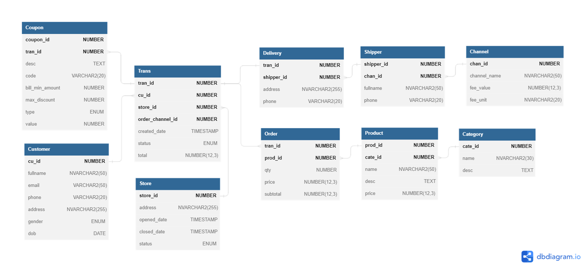
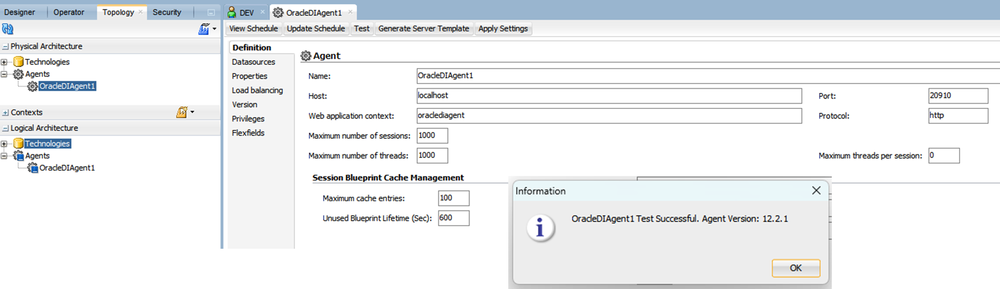

# Data Pipeline & Data Warehouse with Oracle

## Problems Statement
- Model data to handle transaction data when a customer makes an order with a coupon applied and calculates the delivery fee (Sales Data).
- Build an ETL pipeline to import Sales data from flat files (`.csv/.txt`) to a data warehouse in Oracle database.
- Perform basic analysis by building a dashboard of Sales Data.

## Data
Access dataset at [Sales Data](https://drive.google.com/file/d/1Y-Vt-Ev5rRuKDQKx9szugNZf5dpxeROh) 

## Tech-stack
- **Oracle Database 12c**
- **SQLdeveloper**: Data modelling, SQL scripts
- **Oracle Data Integrator 12c**: ETL pipeline
- **Oracle Analytics Desktop**: Analyze data

## Project Diagram


## Data modelling
### Physical schema

Scripts to create tables are stored in [DDL.sql](./DDL.sql) file

### Dimensional model
**Fact**: Trans, Order, Delivery
**Dim**: Customer, Store, Product, Category, Shipper, Channel, Coupon


## ODI setup for loading file to table
Follow the steps:
```
1. Prepare the Source Flat file
1.1 - Defining Source Topology Physical Architecture
1.2 - Defining Source Topology Logical Architecture
1.3 - Defining Source Designer Model

2. Prepare the Target Table
2.1 - Defining Target Topology Physical Architecture
2.2 - Defining Target Topology Logical Architecture
2.3 - Defining Target Designer Model

3. Prepare the Mapping
3.1 - Creating the Designer Project
3.2 - Importing the Knowledge Modules
3.3 - Creating the Mapping

4. Execute the Mapping
```


### Load file into ODI


### Mapping 


### Mapping execution & Debugging


### Incremental Load


Scripts for testing the mapping and creation of data mart tables are stored in [DML.sql](./DML.sql) file

## Manage security

\
**Object** is a representation of a design-time or run-time artifact.
**Method** is an action that can be performed on an object. 


**User** is an ODI user, corresponds to username used to connect to a repo


**Profile** contains a set of privileges. One or more profiles can be assigned to a user


### Example
**DEV** user has READ permission only of Data schema and User profile


## Scheduling
Can plan a execution schedule for a mapping, scenario, package
**Agents** are Java components
- execute jobs on demand 
- start the execution of scenarios according to a schedule defined in ODI

Start an agent command (windows): `./agent.cmd -NAME=OracleDIAgent1`




Running result:


## Building data mart


## Oracle Analytics Desktop

### Overview


### Latest Year


### Volume & Revenue


### Product


## Author
Loc Nguyen Dang 
2023